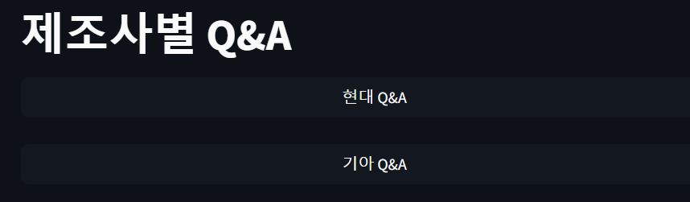

# 👑SK네트웍스 4기_6조👑

### 😇 팀 소개

### 팀명 : 일단커밋해

### 팀원 소개

	
	
	
	

	
|   &nbsp;&nbsp; &nbsp; &nbsp; &nbsp;  &nbsp;  &nbsp;🐶 이호재 &nbsp;&nbsp; &nbsp;&nbsp; &nbsp;  &nbsp;  &nbsp;    |      &nbsp;&nbsp; &nbsp;&nbsp; &nbsp;  &nbsp;  &nbsp;🐱오창준  &nbsp;&nbsp; &nbsp;&nbsp; &nbsp;  &nbsp;  &nbsp;    |      &nbsp;&nbsp; &nbsp;&nbsp; &nbsp;  &nbsp;  &nbsp;🐕하상집  &nbsp;&nbsp; &nbsp;&nbsp; &nbsp;  &nbsp;  &nbsp;    |     &nbsp;&nbsp; &nbsp;&nbsp; &nbsp;  &nbsp;  &nbsp;🐲안준용  &nbsp;&nbsp; &nbsp;&nbsp; &nbsp;  &nbsp;  &nbsp;   | 
|------------------------------------------|--------------------------------------|------------------------------------------|-----------------------------------|

###  🚩 프로젝트 개요 
> 

  
- 프로젝트 명 : 전국 자동자 트랜드 분석 & 현대&기아 FAQ 확인 시스템

- 개발 기간: 2024-08-22 ~ 2024-08-23

- 프로젝트 핵심 기능

  - 자동차 등록 현황 조회 : 전국 자동차 등록대수와 차종,용도별 등록 대수를 날짜 기준으로 **시각화** 
  >
  - 자동차 제조사별 질문 통합 : 현대와 기아차의 대표적인 질문들과 그 답변을 통합 **확인**
  >
  - 제조사별 질문에 대한 검색 : 각 자동차의 질문과 답변에 대한 **검색**

### 👩‍🏫 서비스 목표 
>

  - 사용자로 하여금 다양한 형태로 자동차 등록 대수를 확인하고 추이 분석하여 트랜드 확인
>
  - 한 페이지에서 다양한 제조사의 질문과 답변을 확인으로 편의성 향상
>
  - 제목과 그 답변의 키워드로 검색 지원으로 인한 편의성 향상 

### 🔨 기술 스택

 

### 🐝 프로시저
- pip install -r requirement.txt  : 프로젝트에 설치되는 필수 패키지 설치
>
- crawling > runnner.py 실행 완료 후 streamlit > streamlit run main.py 실행

### 💻 ERD 화면 설계서

### 🧪 테스트 케이스 -자동차 등록 조회 & 자동차 FAQ

<b>자동차 등록현황(월별)</b>

<b>자동차 등록현황(차종)</b>

<b>자동차 등록현황(용도)</b>

<b>자동차FAQ 메인 화면</b>

<b>자동차FAQ 검색/질문조회 기본화면</b>

<b>자동차FAQ 검색/질문조회 검색후 질문조회</b>

   
